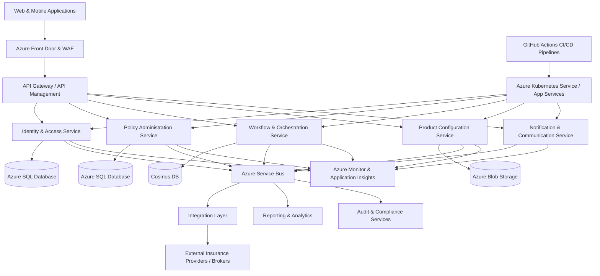

# Cloud-Native Insurance SaaS Platform Architecture

## Architecture Overview

This architecture represents a scalable cloud-native insurance SaaS platform built on Microsoft Azure using a microservices-based approach.

### Entry & Security Layer

Client applications route through Azure Front Door and Web Application Firewall (WAF) to provide:

- global traffic routing
- security protection
- load balancing
- secure external access

API Management centralises routing, authentication, throttling, and service exposure.

### Core Platform Services

The platform is separated into independently deployable domain services including:

- Identity & Access Management
- Policy Administration
- Workflow & Orchestration
- Product Configuration
- Notifications & Communications

This approach improves scalability, resilience, deployment flexibility, and team ownership.

### Data & Storage

Different storage technologies are used depending on workload requirements:

- Azure SQL Database for transactional policy and customer data
- Cosmos DB for scalable workflow and event-driven processing
- Azure Blob Storage for document and file management

### Event-Driven Integration

Azure Service Bus enables asynchronous messaging between services and external integrations.

This supports:

- loose coupling
- improved scalability
- resilient processing
- workflow orchestration
- enterprise integration patterns

### External Integrations

The Integration Layer connects with external insurance providers, brokers, third-party APIs, and enterprise systems.

### Observability & Reliability

Azure Monitor and Application Insights provide:

- telemetry
- tracing
- monitoring
- alerting
- operational visibility

### DevOps & Platform Engineering

Applications are deployed through GitHub Actions CI/CD pipelines into Azure Kubernetes Service (AKS) and Azure App Services.

This enables:

- automated deployments
- scalable infrastructure
- consistent release processes
- operational maturity
- faster delivery cycles

## Engineering Leadership Considerations

The platform design supports:

- multiple Scrum teams
- distributed onshore, offshore, and nearshore delivery models
- scalable SaaS delivery
- engineering governance
- delivery predictability
- operational resilience
- continuous improvement practices
